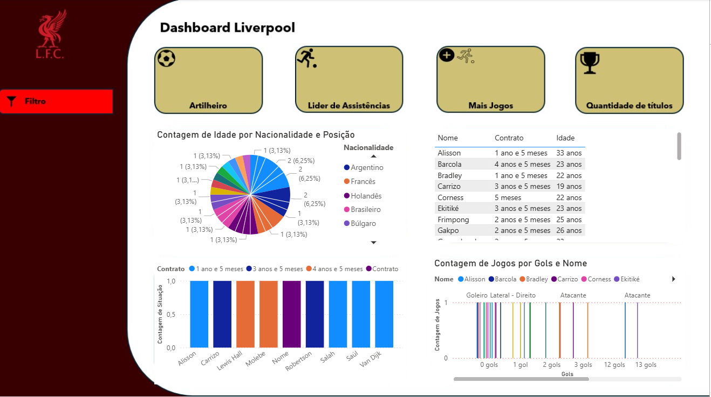
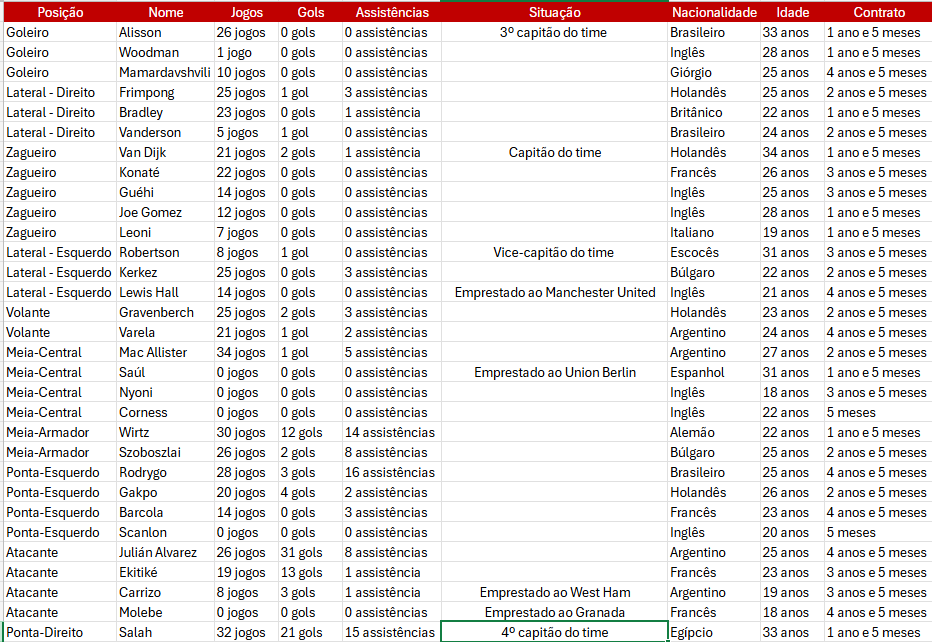

# Análise de Dados - EA FC 25 (Modo Carreira)

## Sobre o Projeto
Este projeto foi desenvolvido unindo minha paixão por futebol e minha formação em Ciência da Computação.  
A ideia foi aplicar **Análise de Dados com Excel e Power BI** para transformar estatísticas do meu time no modo carreira do **EA FC 25** em insights visuais.

## Objetivos
- Estruturar dados de jogadores em planilha (Excel).  
- Criar dashboards no Power BI para acompanhar o desempenho do time.  
- Extrair insights como artilheiros, líderes de assistências e média de idade do elenco.  

## Tecnologias utilizadas
- Microsoft Excel  
- Microsoft Power BI  
- Git/GitHub  

## Principais insights
- **Artilheiro:** Julián Álvarez (31 gols).  
- **Maiores assistentes:** Salah (15) e Molebe (15).  
- **Idade média do elenco:** 23–25 anos.  
- **Gestão de elenco:** alguns jogadores emprestados a outros clubes.  
- **Nacionalidades:** elenco multicultural com jogadores de diferentes países.  

## Dashboards (Power BI)

### Estatísticas dos jogadores

### Planilha Excel do Elenco

## 🚀 Próximos passos
- Adicionar novas temporadas para análise histórica.  
- Comparar desempenho em diferentes competições.  
- Expandir para análise financeira (custo de transferências x desempenho).  

## ✨ Autor
André Ricardo Gonçalves da Silva  
[LinkedIn](https://www.linkedin.com/in/andrericardogdasilva) | [GitHub](https://github.com/dedz-jpg)
